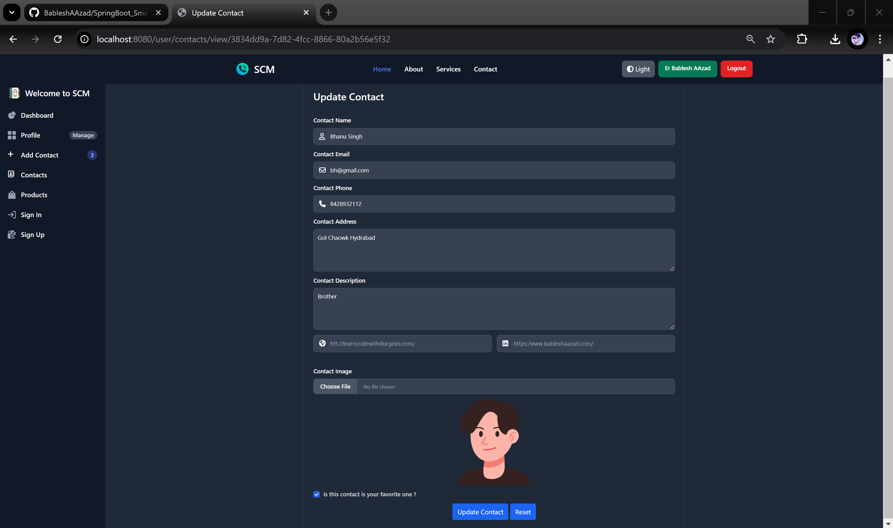
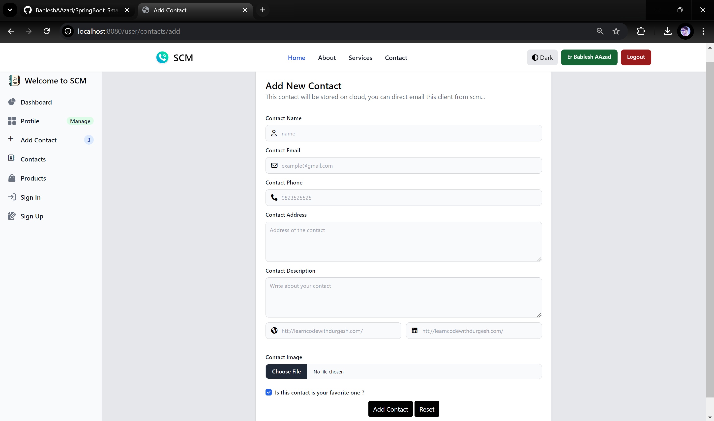
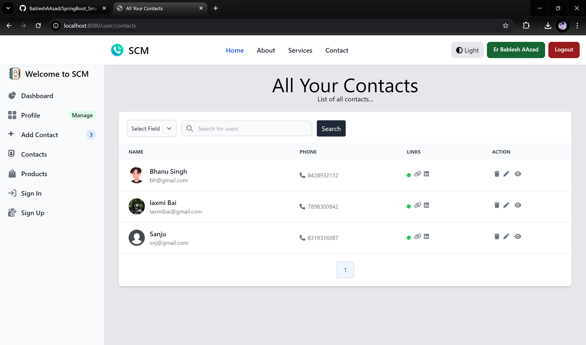
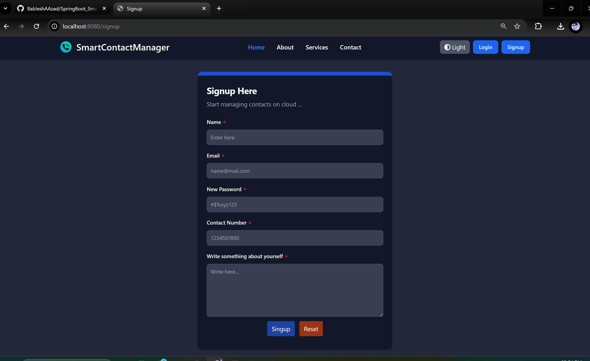
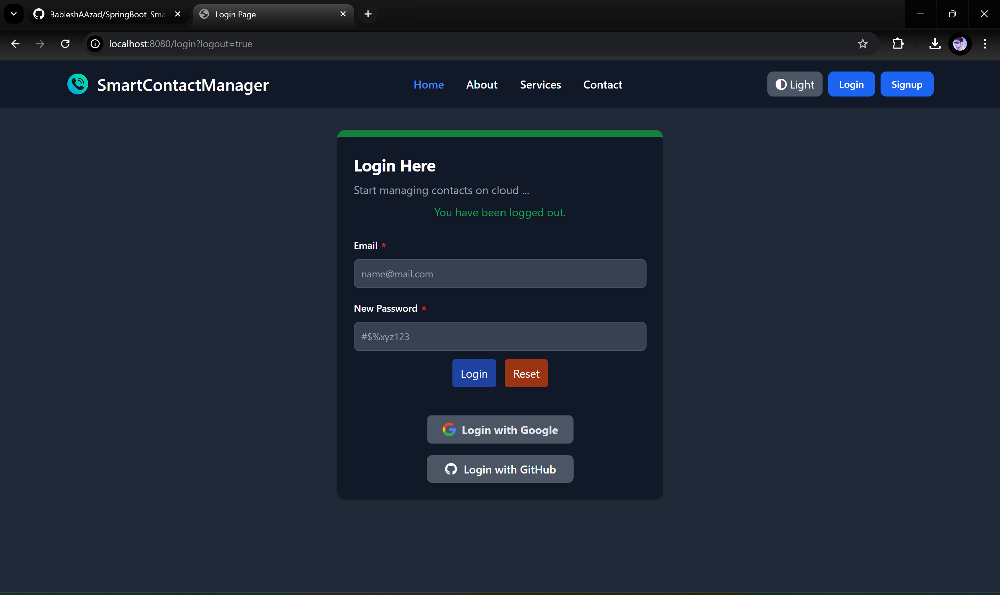

## 🏪 Smart Contact Manager [BableshAAzad.com](https://www.bableshaazad.com)
- This project allows you to store your contacts in the cloud.
- Easily manage your contacts.
- Extract all contacts effortlessly.

---

**🏠 Features:**
- Manage your contacts smartly, with full CRUD operation support.
- You Can easily search you contacts.
- Login using OAuth2, with support for Google and GitHub login.
- Directly send emails to your contacts using their email IDs.
- Your contacts are stored in the cloud, so you'll never lose your contact information.

---

**🧑‍💻 Technologies Used:**

`Spring Boot` `Spring Security` `OAuth2 Client` `MySQL` `Spring Data JPA` `Thymeleaf` `Tailwind CSS` `HTML5` `CSS3`  `JavaScript` `jQuery` `Java`

---

**💻 How to Use the Source Code:**

#### 🚒 <u>Method 3: Setting Up Your Own Server</u>
- Download the master branch as a zip file.
- Import the project into your IDE and ensure JDK 21 is installed.
- Set the following environment variables 👇.
- Install NPM in the root folder using -> `npm install`
- To run the CSS file -> open the command line and enter the following code:
  `npx tailwindcss -i src/main/resources/static/css/input.css -o src/main/resources/static/css/output.css --match`

#### 🔐 Environment Variables:

<u>For Storing Images in Cloud using Cloudinary</u>
>1. `CLOUDINARY_KEY`= 123YourKey
>2. `CLOUDINARY_SECRET`= abcdeYourPassword
>3. `CLOUDINARY_NAME`= abcdYourName

<u>For GitHub OAuth2 Connection</u>
>4. `GITHUB_CLIENT_ID`= 12345YourID
>5. `GITHUB_CLIENT_SECRET`= dummyKey12345

<u>For Google OAuth2 Connection</u>
>6. `GOOGLE_CLIENT_ID`= YourGoogleIDxyz
>7. `GOOGLE_CLIENT_SECRET`= googleSecret

<u>For Sending Mail to Your Contacts</u>
>8. `MAIL_PASSWORD`= mailPassword
>9. `MAIL_USERNAME`= yourMail@gmail.com

---

#### 💻 UI Pages Sample:

  
  

  

  
  

